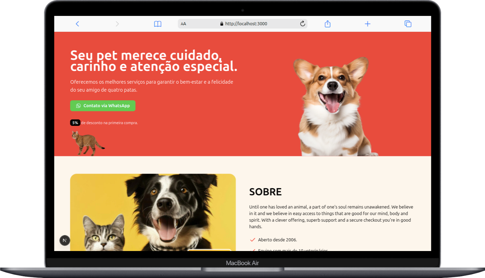

# 🐾 Pet Shop - Página Institucional

Projeto de uma landing page desenvolvida com **Next.js**, **React**, **Tailwind CSS** e **TypeScript**, com o objetivo de apresentar os serviços, depoimentos de clientes, marcas parceiras, informações de contato e redes sociais de um Pet Shop (ficticio). Com proposito de continuar evoluindo e aprendendo novas tecnologias.

---

## 🖼️ Preview

<div style="display: flex; gap: 12px; flex-wrap: wrap; justify-content: center;">
  
  
</div>

---

## 🚀 Tecnologias Utilizadas

- [Next.js](https://nextjs.org/)
- [React](https://reactjs.org/)
- [Tailwind CSS](https://tailwindcss.com/)
- [TypeScript](https://www.typescriptlang.org/)

---

## 📸 Funcionalidades

- ✅ Apresentação dos **serviços oferecidos**
- ✅ Sessão de **depoimentos de clientes**
- ✅ Logos das **marcas parceiras**
- ✅ Informações de **contato**, **endereço** e **redes sociais**
- ✅ Layout 100% **responsivo**
- ✅ Estilização com **Tailwind CSS**

---

## 📦 Instalação e uso

```bash
# Clone o repositório
git clone https://github.com/gaby-mvi/Landing-Page-Pet-Shop.git

# Acesse o diretório
cd Landing-Page-Pet-Shop

# Instale as dependências
npm install

# Inicie o servidor de desenvolvimento
npm run dev
```
---

## 🌐 Deploy

O projeto está disponível online via Vercel:

🔗 https://petshop-landing.vercel.app

---

## 📄 Licença
Este projeto está licenciado sob os termos da MIT License.

Você pode usar, copiar, modificar e distribuir conforme desejar, com ou sem fins comerciais, desde que mantenha os créditos ao autor.

Feito com 💙 por Gabriela Rosa